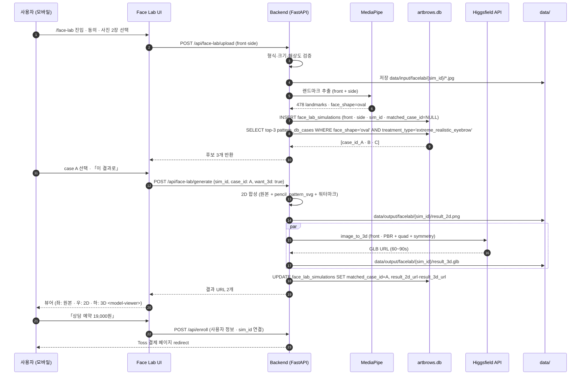

# Face Lab v7 · User Flow v1.0

> 작성: 최예진 (SaaS C PM · MetaHuman / Unreal) · 이서연 (기획) 통합
> 확정: 2026-07-02 D+2 오후 · 개발 기획서 § 4·§ 5 (SaaS C) 상세본
> 목적: 정면 + 측면 사진 → 원장님 패턴 매칭 → 2D 펜슬 + 3D GLB 결과 흐름 명세

## 0. 한 줄 정의

**Face Lab v7 = 정면·측면 사진 2장을 올리면, 장미지 원장님의 30년 패턴 DB 에서 얼굴형 매칭해 「시술 전 펜슬로 그려드린 결과 시뮬」 을 2D + 3D 로 확인.**

- 익명 체험 가능 (회원가입 없이 시뮬만) — 결과 저장 · 상담 예약 시 회원가입 유도
- 결과 이미지에 「체험용 · ARTbrows Face Lab」 워터마크 자동 (의료광고법 §5.3 정합)
- 상담 예약으로 즉시 전환 (Toss 예약금 19,000원)

## 1. 큰 흐름

```
① 진입      → SaaS A 홈 or 광고 랜딩 → /face-lab
② 안내      → 3단계 프리뷰 (사진 → 결과 → 상담)
③ 사진 업로드 → 정면 + 측면 각 1장 (JPG · PNG · HEIC · ≤10MB · ≥1024×1024)
④ 검증      → MediaPipe 478 랜드마크 자동 · 얼굴형 자동 분류
⑤ 패턴 매칭  → pattern_db_cases 에서 face_shape + treatment_type 기준 top-3 후보
⑥ 결과 생성  → 2D 펜슬 가이드 PNG + 3D GLB (Higgsfield image_to_3d 30 크레딧)
⑦ 결과 보기  → viewer (좌: 원본 · 우: 시뮬 · 3D 회전) + 워터마크
⑧ CTA      → 「상담 신청」 (Toss 19,000원 예약금) · 「결과 저장」 (회원가입 유도)
⑨ 재조회    → 회원인 경우 시뮬 이력 조회 · 추가 시뮬
```

## 2. 상세 시나리오 (익명 사용자 · 첫 진입)

### 2.1 진입 & 안내 (① · ②)
- **경로:** `https://lab.staris.cloud/face-lab` (SaaS A 홈 hero CTA · 광고 랜딩 CTA)
- **첫 화면:** 3 스텝 프리뷰 (사진 → 결과 → 상담) + 「원장님 30년 패턴 DB 매칭」 · 「체험용 워터마크 포함」 고지
- **회원가입 유도:** 없음 · 「무료 체험 시작」 버튼만
- **동의:** 「Face Lab 체험용 이미지 사용에 동의합니다」 체크박스 (필수 · `medical_consent`)

### 2.2 사진 업로드 (③)
- **필수 2장:** 정면 (`front`) · 측면 (`side`)
  - side 는 좌·우 상관없음 (모델이 좌우 정규화)
- **제약:**
  - 형식: `jpg`, `jpeg`, `png`, `heic`
  - 최소 해상도: `1024 × 1024`
  - 최대 크기: 10 MB
- **UX:**
  - 카메라 직접 촬영 가능 (모바일 우선)
  - 「좋은 사진 예시」 4장 (정면 정중앙 · 측면 90도 · 자연광 · 머리카락 정리)
  - 「나쁜 사진 예시」 4장 (측면 각도 부족 · 안경 · 마스크 · 옆머리 가림)
- **업로드:** `POST /api/face-lab/upload` · multipart · 서버측 재검증 (형식·크기·해상도)
- **저장 위치:** `data/input/facelab/{sim_id}/{front|side}.{ext}` (임시 · TTL 24h · 회원 저장 요청 시 영구)

### 2.3 자동 검증 & 얼굴형 분류 (④)
- **MediaPipe 478 랜드마크:** Python 서버에서 `mediapipe>=0.10.0` 로 추출
- **얼굴형 분류:** 랜드마크 비율 → `oval · long · round · heart · square` 5종 중 하나
- **랜드마크 없음 (얼굴 미검출):** 「사진에서 얼굴을 찾지 못했어요. 다른 사진으로 시도해주세요.」 → 재업로드
- **양안 미검출·눈썹 미검출:** 「눈썹 부위가 잘 보이는 사진으로 다시 올려주세요.」
- **처리 시간:** ~3초 (백엔드 비동기)

### 2.4 패턴 매칭 (⑤)
- **매칭 소스:** `pattern_db_cases` (원장님 30년 패턴 DB · Phase 1 시점 6점 시드 → 100점 이상 확장 예정)
- **매칭 기준:**
  - `face_shape` 일치 (5 shape)
  - `treatment_type` 사용자 선택 (기본: `extreme_realistic_eyebrow`)
- **결과:** top-3 후보 case_id 반환 (satisfaction_score 우선 · 최신 우선)
- **선택 UX:** 3 후보 나란히 표시 + 「이 결과로 시뮬」 버튼

### 2.5 결과 생성 (⑥)
- **2D 펜슬 가이드 (필수):**
  - 원본 정면 + 매칭 case 의 `pencil_pattern_svg` 오버레이
  - PIL + cairosvg (또는 서버측 canvas) 로 합성
  - 「체험용 · ARTbrows Face Lab」 워터마크 자동 (우측 하단 · 알파 0.3)
  - 저장: `data/output/facelab/{sim_id}/result_2d.png`
- **3D GLB (선택 · 크레딧 소모):**
  - Higgsfield `image_to_3d` (PBR + quad + symmetry · 30 크레딧/회)
  - 익명 사용자: 3D 결과는 첫 회 무료 (초대 유도) · 익명 세션당 1회 제한
  - 회원: 무제한 (Phase 3 이후 요금제 검토)
  - 저장: `data/output/facelab/{sim_id}/result_3d.glb`
- **소요 시간:** 2D 5초 · 3D 60~90초 (백엔드 폴링)
- **DB 저장:** `face_lab_simulations` INSERT (`user_id` NULL 익명 허용)

### 2.6 결과 뷰어 (⑦)
- **레이아웃:**
  - 좌: 원본 정면 · 우: 시뮬 결과 (2D 펜슬 가이드 오버레이)
  - 하단: 3D GLB `<model-viewer>` (회전 · 확대 축소)
- **필수 노출:**
  - 「체험용」 워터마크 (뷰어에서도 시각 확인 가능)
  - 매칭된 원장님 케이스 정보 (case_id · treatment_type · 원장님 직접 노트 발췌)
  - 「실 시술 시 원장님과 상담 후 미세 조정됩니다」 문구
- **공유:** PNG 다운로드 가능 · SNS 공유 시 워터마크 유지
- **재시도:** 「다른 사진으로 다시」 · 「다른 스타일로 매칭」

### 2.7 CTA (⑧)
- **주 CTA:** 「원장님과 상담 예약 (19,000원)」 → Toss 결제 → `class_enrollments` (schedule_id=상담 예약 슬롯)
- **부 CTA:** 「결과 저장하기」 → 회원가입 유도 (카카오 SSO 1클릭)
- **비활성 CTA:** 「나중에 다시 볼래요」 (익명 세션 TTL 24h)

### 2.8 재조회 (⑨ · 회원 전용)
- `/face-lab/history` → 지난 시뮬 결과 리스트 (썸네일 + 날짜)
- 「추가 시뮬 」 · 「원장님께 문의」 · 「이 결과로 상담 예약」

---

## 3. 상세 시나리오 (회원 · 재방문)

- **차이점:** 익명 흐름 + `user_id` 자동 연결 + 시뮬 결과 영구 저장 + 이력 접근
- **알림:** 시뮬 결과 완료 시 카카오 알림톡 발송 옵션 (사용자 설정)
- **A/B 실험:** 회원 시뮬 결과 → 「상담 예약 CTA」 vs 「강의 카탈로그」 (수강생 전환 funnel 실험)

---

## 4. 관리자 · 원장님 흐름

### 4.1 신규 케이스 추가
- 원장님 시술 후 사진 (before · after) + 펜슬 스케치 (svg 또는 png 트레이스) 업로드
- 자동 랜드마크 추출 + 얼굴형 자동 분류 (Gemini Flash 로 verify 대기 큐)
- 원장님 수동 확인 후 `verified=1` 표시 → 실 시뮬 매칭에 사용

### 4.2 만족도·클레임 수집
- 실 시술 후 D+14 자동 설문 → `pattern_db_cases.satisfaction_score` 갱신
- 클레임 접수 시 해당 case `claim_filed=1` → 매칭 우선순위 하락

### 4.3 원장님 대시보드
- 이번 주 시뮬 건수 · 상담 전환율 · Top-매칭 case
- Gemini Flash 자동 분류 정확도 (verify 대기 큐 상태)

---

## 5. 데이터 흐름 (시퀀스)



---

## 6. 엔드포인트 (Phase 1 · D+3 이후)

| 경로 | 메서드 | 인증 | 역할 |
|------|--------|------|------|
| `/api/face-lab/upload` | POST | 익명 OK | 사진 2장 업로드 · sim_id 발급 |
| `/api/face-lab/match` | POST | 익명 OK | 매칭 top-3 반환 |
| `/api/face-lab/generate` | POST | 익명 OK | 2D + 3D 결과 생성 |
| `/api/face-lab/{sim_id}` | GET | 익명 OK (24h) · 회원 무제한 | 결과 조회 |
| `/api/face-lab/save` | POST | 회원 필수 | 익명 결과 → 회원 계정에 영구 저장 |
| `/api/face-lab/history` | GET | 회원 필수 | 이력 리스트 |
| `/api/facelab/admin/verify-case` | POST | 관리자 | 신규 케이스 verify |

---

## 7. 컴플라이언스 요약

| 항목 | 처리 |
|------|------|
| 의료광고법 §5.3 | 결과 이미지에 「체험용」 워터마크 자동 · 「실 시술 결과와 다를 수 있습니다」 문구 |
| PIPA | 얼굴 이미지 사용 동의 필수 (`medical_consent`) · 24h TTL (익명) · revoke 시 즉시 삭제 |
| 저작권 | 결과 이미지 워터마크 유지 필수 · 상업적 사용 금지 (약관) |
| 데이터 최소화 | 랜드마크 JSON 은 저장 · 원본 사진은 익명 24h TTL |

---

## 8. Phase 1 착수 순서

| 시점 | Task | 산출물 |
|------|------|-------|
| D+3 T39 (최예진) | 사진 업로드 UI + MediaPipe 통합 | `/face-lab` 페이지 + `/api/face-lab/upload` |
| D+4 T47 (최예진) | 2D 결과 PNG + 3D `<model-viewer>` 통합 | 결과 뷰어 |
| D+5 T55 (최예진) | 의료광고법 워터마크 자동화 | PIL 합성 · 알파 0.3 |
| D+6 (피드백) | 원장님 시범 사용 | 실 사진으로 매칭 정확도 확인 |
| D+7 (정식 가동 준비) | 실 case 5점 이상 추가 · 매칭 정확도 검증 | Phase 2 진입 |

## 9. 문서 이력

| 버전 | 날짜 | 변경 |
|------|------|------|
| v1.0 | 2026-07-02 | 초기 확정 (D+2 오후) |

## 관련 문서
- [[artbrows-jangmiji-pattern-library]] · [[artbrows-pre-treatment-pencil]] · [[artbrows-platform-vision-2026-06-29]]
- [[artbrows-prd-v1-2026-06-30]] § 4·5·10 SaaS C
- `docs/USER-SCENARIOS-v1.md` A-⑤ 신뢰 형성 접점
- `docs/API-INTEGRATION-SPEC-v1.md` § 1.4 Higgsfield
- `alembic/versions/0001_initial_schema.py` face_lab_simulations · pattern_db_cases
- `docs/TASK-BREAKDOWN-56.md` T13·T14·T29·T30·T39·T47·T55
