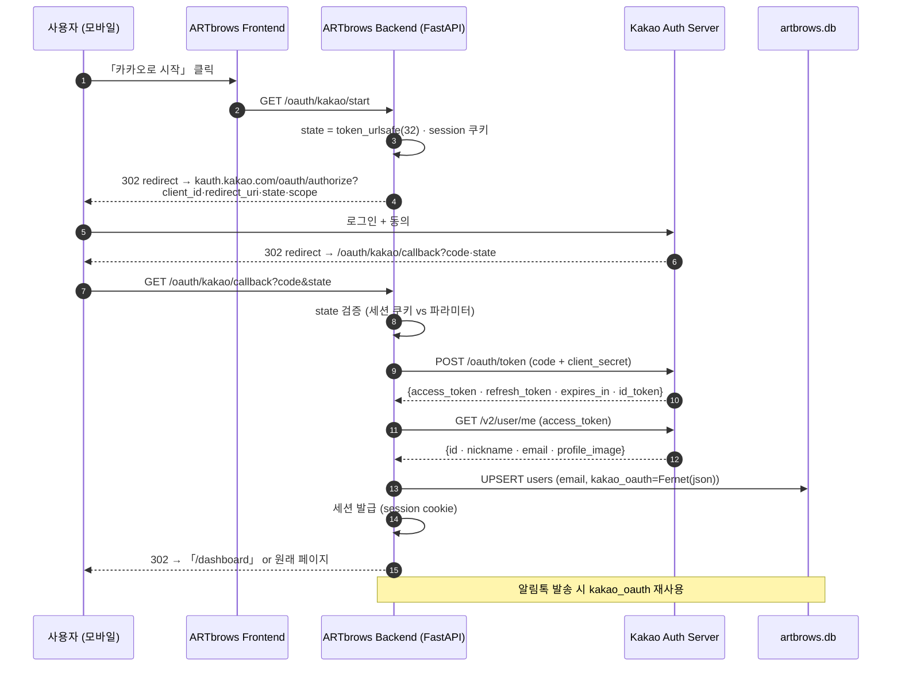
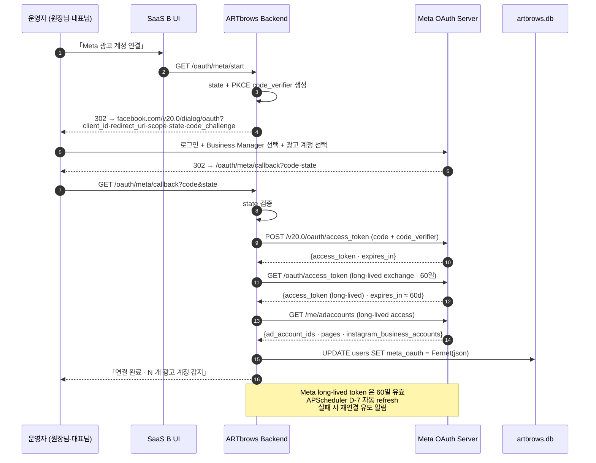
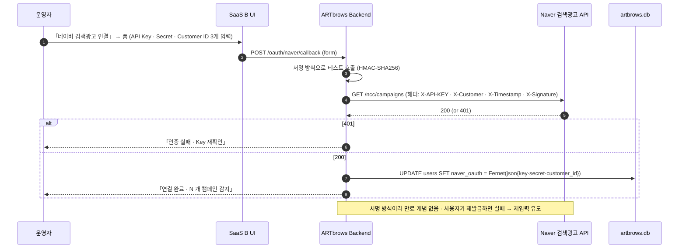
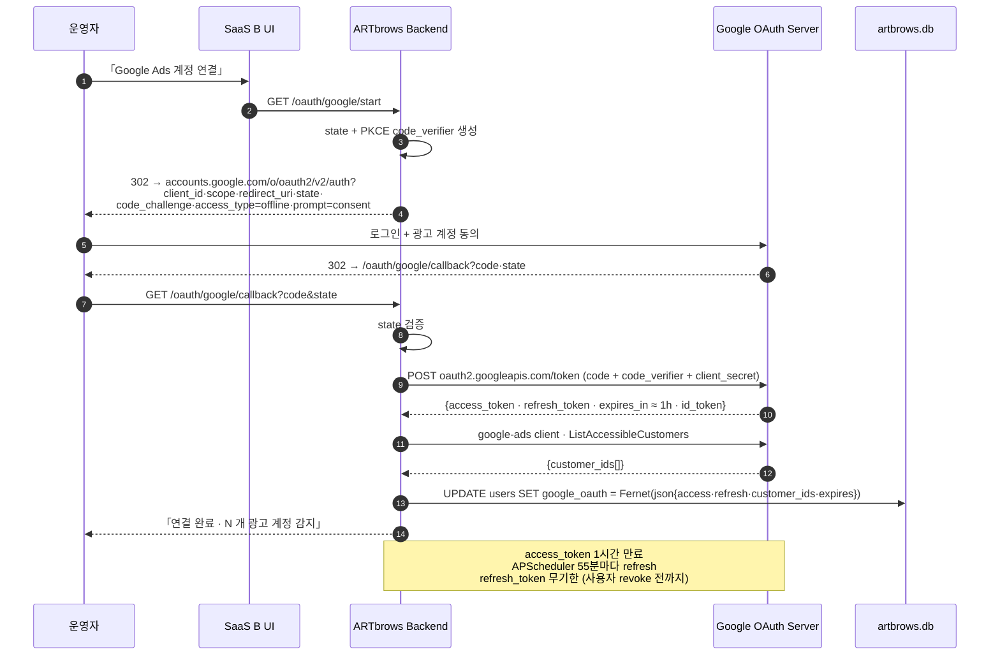

# OAuth Sequence v1.0 — 4 Provider

> 작성: 박서윤 (SaaS B PM · OAuth 담당) · 한승철 (백엔드 라우터)
> 확정: 2026-07-02 D+2 오후 · 개발 기획서 § 10 (보안 · 컴플라이언스) 상세본
> 목적: 카카오 SSO (메인) · Meta / Naver / Google (광고 API) 4종 OAuth 흐름 명세

## 0. 공통 원칙

1. **콜백 URL 통일:** `https://lab.staris.cloud/oauth/{provider}/callback`
2. **State 파라미터:** CSRF 방지용 `secrets.token_urlsafe(32)` · Redis 없이 세션 쿠키 저장 (Phase 1)
3. **토큰 암호화:** access · refresh 모두 Fernet 대칭키로 암호화하여 `users.{provider}_oauth` 컬럼 저장 (JSON)
4. **PKCE:** Google · Meta 는 PKCE 지원 → 사용 (모바일 웹 안전성)
5. **리프레시:** APScheduler 로 만료 30분 전 자동 갱신 · 실패 시 재로그인 유도
6. **에러 처리:** 사용자에게는 «다시 시도해주세요» + 관리자에게 텔레그램 봇 알림
7. **로그아웃:** 세션만 종료 · 토큰은 `users` 테이블에 남기고 next-login 재사용

## 0.1 라우터 규약

| 경로 | 메서드 | 역할 |
|------|--------|------|
| `/oauth/{provider}/start` | GET | 로그인 시작 (state 생성 + provider 로 redirect) |
| `/oauth/{provider}/callback` | GET | provider 응답 처리 · 토큰 저장 · 세션 발급 |
| `/oauth/{provider}/refresh` | POST (internal) | access token 갱신 (APScheduler 호출) |
| `/oauth/{provider}/revoke` | POST | 사용자 요청 시 연동 해제 (PIPA) |

**모듈:** `agents/auth/oauth/{provider}.py` (각 provider 별 로직 분리)

---

## 1. 카카오 SSO (메인 소셜 로그인)

**용도:** SaaS A 회원가입·로그인 · 알림톡 발송 권한 확보
**Scope:** `profile_nickname`, `account_email`, `talk_message`



**주의:** 카카오는 파이썬 공식 SDK 없음 → REST 직접 (`requests` 또는 `httpx`).
카카오 이메일은 사용자가 동의를 안 하면 nickname 만 옴 → 그 경우 `users.email = "kakao_${id}@nomail.local"` 생성 후 별도 이메일 등록 CTA 노출.

---

## 2. Meta OAuth (Instagram · Facebook 광고 API)

**용도:** SaaS B 광고 캠페인 생성 · 인사이트 조회 · 인스타 콘텐츠 게시
**Scope:** `ads_management`, `pages_read_engagement`, `instagram_content_publish`
**전제:** Meta Business Verification 완료 (사업자등록증) — **결정 대기 C** 해소 필요



**Mock 모드:** 발급 완료 전 (5~7일) `agents/mocks/meta_mock.py` 로 위 응답 흉내 → UI · 라우터 · DB 저장 로직 완성.
**주의:** Instagram Business 계정은 Facebook 페이지에 연결되어야 발견됨 → onboarding 단계에서 페이지 선택 UX 강조.

---

## 3. Naver 검색광고 OAuth (실제로는 API Key 방식)

**용도:** SaaS B 네이버 검색광고 캠페인 관리 · 키워드 입찰
**인증 방식:** Naver 검색광고는 OAuth 가 아닌 **API Key + Secret Key + Customer ID** 방식
**전제:** 네이버 광고주 센터 승인 (3~5일)



**UX 주의:** OAuth 아님을 사용자에게 설명 (다른 provider 와 다름).
「어디에서 발급받나요?」 링크 → 네이버 광고주 센터 가이드 URL 노출.

---

## 4. Google Ads OAuth 2.0

**용도:** SaaS B Google 검색광고 캠페인 관리
**Scope:** `https://www.googleapis.com/auth/adwords`
**전제:** Google Ads Developer Token 승격 (Basic → Standard · 5~10일)



**Developer Token 대기 (5~10일):** 대기 중 Mock (`agents/mocks/google_ads_mock.py`) 로 UI 완성.
`prompt=consent` 필수 (refresh_token 을 항상 발급받기 위함).

---

## 5. 토큰 저장 · 암호화

### 5.1 스키마 (이미 `users` 테이블에 컬럼 존재)

```
users
├── kakao_oauth   TEXT   -- Fernet(json)
├── meta_oauth    TEXT   -- Fernet(json)
├── naver_oauth   TEXT   -- Fernet(json)
└── google_oauth  TEXT   -- Fernet(json)
```

### 5.2 JSON 페이로드 예시

```json
{
  "access_token": "...",
  "refresh_token": "...",
  "expires_at": 1751500800,
  "extras": { "customer_ids": ["123-456-7890"] }
}
```

### 5.3 Fernet 키 로드

```
~/.artbrows-secrets/fernet_key   ← 32-byte base64 (git ignore)
env var:                          ARTBROWS_FERNET_KEY
utils/crypto.py:                  load_key() · encrypt(json) · decrypt(str) -> json
```

**키 회전:** Phase 3 (베타 직전) 에 절차 확정. 회전 시 이전 키도 임시 유지 (MultiFernet).

---

## 6. Refresh 스케줄

| Provider | 만료 | Refresh 시점 | 실패 시 |
|----------|------|--------------|---------|
| Kakao | access 6h · refresh 60d | 만료 30분 전 | 재로그인 알림 |
| Meta | long-lived 60d | 만료 D-7 | 재연결 알림 · 광고 발송 일시 중지 |
| Naver | 만료 없음 (Key 방식) | - | Key 변경 감지 시 재입력 |
| Google | access 1h · refresh 무기한 | 55분 주기 | refresh 실패 시 재연결 |

**구현:** `agents/schedulers/oauth_refresh.py` · APScheduler cron trigger

---

## 7. 에러 매트릭스

| 코드 | 원인 | UX | 백엔드 |
|------|------|-----|-------|
| `state_mismatch` | CSRF 의심 | 「다시 시도해주세요」 | 로그 · 텔레그램 알림 |
| `token_exchange_failed` | code 재사용 · 만료 | 「연결 실패 · 재시도」 | 로그 |
| `insufficient_scope` | scope 동의 누락 | 「추가 권한이 필요합니다」 | 재로그인 URL |
| `refresh_failed` | refresh_token 폐기 | 「재로그인 필요」 (배너) | APScheduler 알림 |
| `provider_unavailable` | 429 · 500 | 「잠시 후 다시 시도」 | 지수 백오프 |

## 8. 컴플라이언스

- **PIPA:** OAuth 동의 페이지에 「개인정보 처리방침」 링크 노출 · `users.pii_consent` 갱신
- **DPO 처리:** 회원 탈퇴 요청 시 60일 안 토큰 revoke + `users.*_oauth = NULL` + DB 안 개인 데이터 삭제
- **로그 최소화:** 토큰 값은 로그에 절대 남기지 않음 (마지막 8자만 마스킹 후 기록)

## 9. Mock 모드 스위치

`env: ARTBROWS_OAUTH_MOCK=1` → 모든 provider 콜백을 mock 응답으로 대체 (Phase 1 개발 · 발급 대기 우회)
Mock 응답 소스: `agents/mocks/{provider}_mock.py`

## 10. Phase 1 착수 순서

1. D+3 T35 (한승철): 카카오 SSO 실 연동 (`/oauth/kakao/start` · `/callback` · Fernet 저장)
2. D+3 T38 (박서윤): Meta OAuth Mock 라우터 완성
3. D+4 T43 (한승철): Naver Key 입력 폼 + 서명 방식 검증
4. D+5 T51 (한승철): Google Ads OAuth 실 연동 (Developer Token 승격 후)
5. D+6 T54 (박서윤): 4 provider 통합 상태 페이지 (「내 계정」 대시보드)

## 관련 문서
- [[artbrows-prd-v1-2026-06-30]] § 10 보안
- [[artbrows-api-keys-storage]] 비밀 관리
- `docs/API-INTEGRATION-SPEC-v1.md` § 5 인증·SSO
- `alembic/versions/0001_initial_schema.py` users.{provider}_oauth 컬럼
- `docs/TASK-BREAKDOWN-56.md` T11·T21·T35·T38·T43·T51·T54
